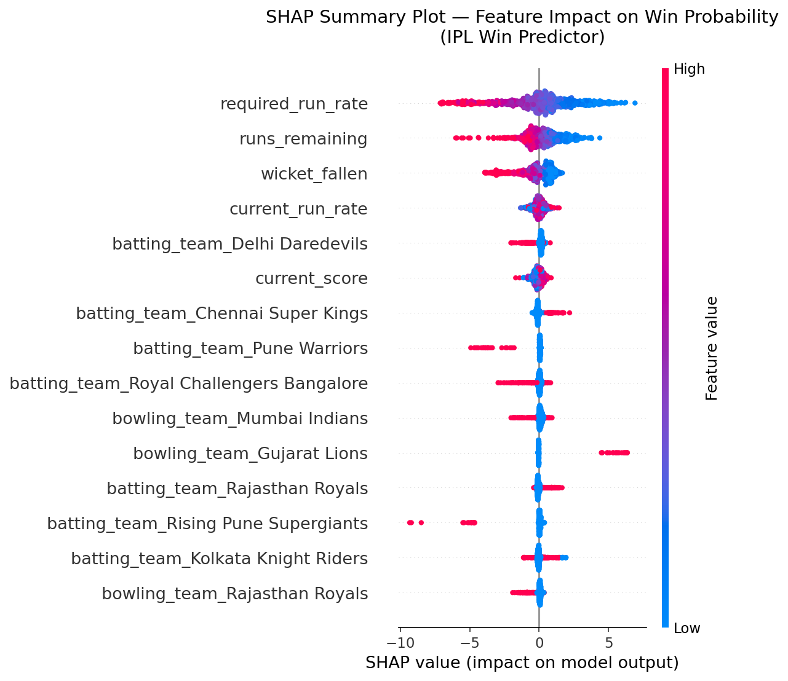
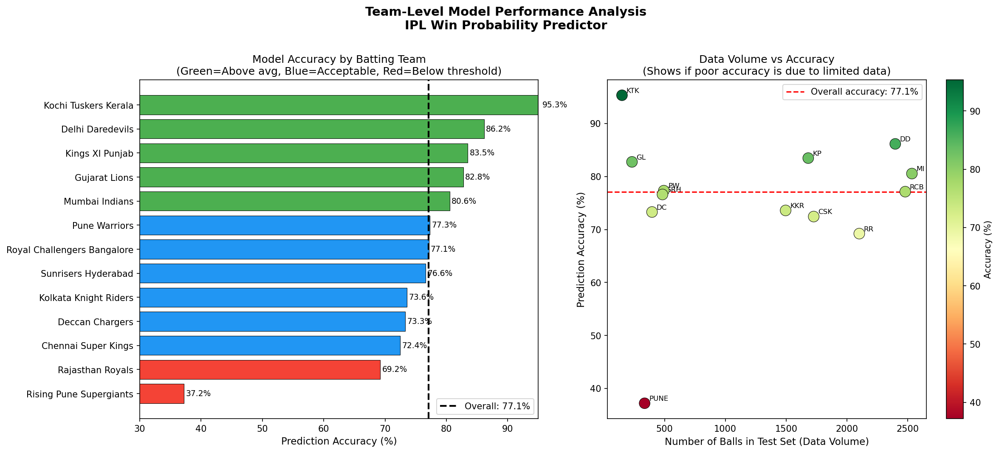
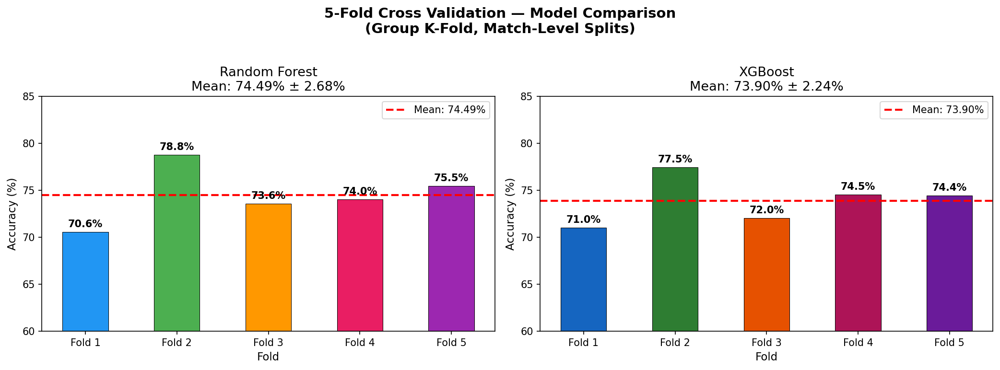

# 🏏 IPL Win Probability Predictor

A machine learning web application that predicts 
win probability for IPL cricket matches in real time, 
trained on 15 years of ball-by-ball IPL data (2008-2019).

🚀 **[Live Demo →](YOUR_STREAMLIT_URL_HERE)**

---

## 📊 Key Results

| Metric | Value |
|--------|-------|
| Algorithm | XGBoost (tuned) |
| Test Accuracy | 77.95% |
| Cross Validation | 73.85% ± 1.87% (5-Fold GroupKFold) |
| Training Data | 83,933 ball-by-ball records across 724 matches |
| Seasons Covered | IPL 2008-2019 |

---

## 🖥️ App Features

- **Real-time win probability** — enter any match situation
  and get instant prediction with confidence gauge
- **Key factors analysis** — human-readable explanation 
  of what's driving the prediction
- **Match situation metrics** — required run rate, 
  current run rate, runs needed, overs remaining

---

## 🔬 Technical Highlights

### 1. Group Leakage Detection & Fix
Initial model showed suspicious 98.7% accuracy. 
Investigation revealed **group leakage** — random 
row-level train/test splitting caused balls from the 
same match to appear in both train and test sets. 

Fixed using **match-level GroupKFold splitting** — 
entire matches go either fully into train or test, 
never both. Accuracy dropped to honest 76-78%.

> This is a common but critical mistake in sequential 
> data ML problems that most implementations miss.

### 2. SHAP Explainability
Implemented SHAP (SHapley Additive exPlanations) 
to make predictions fully explainable:



Key finding: Built-in feature importance incorrectly 
ranked defunct teams as top features. SHAP correctly 
identified required run rate, wickets fallen, and 
current run rate as primary predictors — validating 
genuine cricket domain knowledge.

### 3. Hyperparameter Tuning
Used RandomizedSearchCV (50 combinations, 5-Fold 
GroupKFold) to optimize XGBoost hyperparameters:

| Parameter | Default | Tuned |
|-----------|---------|-------|
| n_estimators | 100 | 400 |
| learning_rate | 0.3 | 0.01 |
| max_depth | 6 | 4 |
| subsample | 1.0 | 0.6 |
| min_child_weight | 1 | 7 |
| colsample_bytree | 1.0 | 0.8 |
| gamma | 0 | 0.5 |

**Result:** +1.84% accuracy improvement over baseline

Key insight: Conservative settings won — low learning 
rate with many trees outperformed aggressive defaults, 
reflecting cricket's inherent match-to-match 
unpredictability.

### 4. Team-Level Fairness Analysis
Analyzed model performance per franchise:



**Findings:**
- Best calibrated: SRH (0.1% gap), KXIP (1.2% gap)
- Systematic underestimation of strong teams 
  (MI, CSK, RCB) by ~8-10%
- Root cause: model cannot capture player-level 
  quality factors (individual brilliance, 
  pressure handling)

### 5. Cross Validation
Used 5-Fold GroupKFold cross validation (match-level) 
to get statistically robust accuracy estimates:



```
XGBoost:       73.85% ± 1.87%
Random Forest: 74.70% ± 2.38%
Final tuned XGBoost: 77.95% (after hyperparameter tuning)
```

Selected XGBoost for lower variance — consistency 
matters more than ceiling in production deployment.

---

## 🗂️ Project Structure

```
ipl-win-predictor/
├── app/
│   └── app.py                    # Streamlit web app
├── data/
│   └── model_ready_data.csv      # Processed dataset
├── models/
│   ├── win_predictor_model.pkl   # Trained XGBoost model
│   └── model_columns.pkl         # Feature column structure
├── notebooks/
│   ├── day1_setup_and_data_loading.ipynb
│   ├── day2_data_exploration.ipynb
│   ├── day3_data_cleaning.ipynb
│   ├── day4_feature_engineering.ipynb
│   ├── day5_model_training.ipynb
│   ├── day6_cross_validation.ipynb
│   ├── day7_shap_explainability.ipynb
│   ├── day8_hyperparameter_tuning.ipynb
│   └── day9_team_analysis.ipynb
├── outputs/                      # Charts and analysis
├── requirements.txt
└── README.md
```

---

## 🚀 Run Locally

```bash
# Clone repository
git clone https://github.com/gupta4261/ipl-win-predictor.git
cd ipl-win-predictor

# Install dependencies
pip install -r requirements.txt

# Download raw data from Kaggle
# Place matches.csv and deliveries.csv in data/ folder
# Dataset: https://www.kaggle.com/datasets/ramjidoolla/ipl-data-set

# Run notebooks in order (day1 through day9)
# Then launch the app:
streamlit run app/app.py
```

---

## ⚠️ Known Limitations

**Rising Pune Supergiants**
Only 2 IPL seasons (2016-2017) — insufficient training 
data for reliable predictions. Treat with lower confidence.

**Chennai Super Kings**
Hardest team to predict (68.7% accuracy) — CSK's 
historically unpredictable match performances 
(winning from difficult positions) challenge purely 
statistics-based models.

**Data Coverage**
Trained on IPL 2008-2019 only. Teams that changed 
significantly post-2019 may show reduced accuracy.

**Systematic Calibration Bias**
Model underestimates strong teams (MI, CSK, RCB) 
by ~8-10%. Root cause: model cannot capture 
player-level quality factors.

---

## 🔮 Future Improvements

- Add player-level features (strike rates, 
  bowling economy in death overs)
- Add venue/pitch condition features
- Apply Isotonic Regression for probability calibration
- Expand dataset to include IPL 2020-2024
- Implement live API integration for real-time updates

---

## 🛠️ Tech Stack

```
Python          Data processing and modeling
XGBoost         Primary ML algorithm
Scikit-learn    Cross validation, preprocessing
SHAP            Model explainability
Streamlit       Web application
Plotly          Interactive visualizations
Pandas/NumPy    Data manipulation
```

---

## 📈 Model Development Journey

```
Step 1: Data cleaning (removed DL matches, 
        name inconsistencies)
Step 2: Feature engineering (cumulative stats, 
        run rates, edge case handling)
Step 3: Discovered group leakage (98.7% → 76%)
Step 4: Match-level cross validation
Step 5: SHAP explainability analysis
Step 6: Hyperparameter tuning (+1.84%)
Step 7: Team fairness analysis
Final:  77.95% honest, validated accuracy
```

---

*Built by [Aditya Kumar Gupta] | [https://www.linkedin.com/in/adityagupta-ds/] | [https://github.com/gupta4261]*